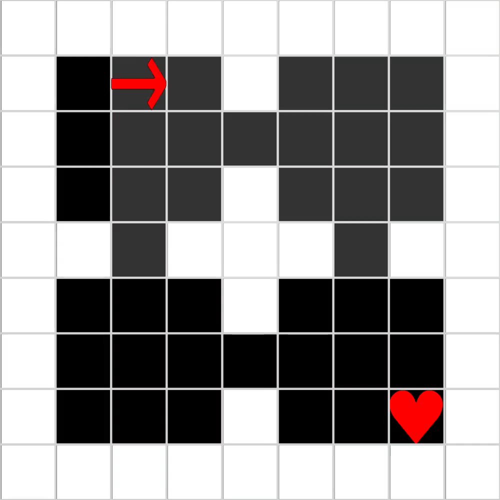

# Gridworld

This project aims to provide some simple grid world environments similar to [gym-minigrid](https://github.com/maximecb/gym-minigrid) for reinforcement learning research in Julia.

## Design

A `GridWorldBase` is used to represent the whole grid world. Inside of it, a 3-D `BitArray` of size `(n_objects, height, width)` is used to encode objects in each tile.

## Usage

```julia
using Gridworld

w = EmptyGridWorld()

w(MOVE_FORWARD)
w(TURN_LEFT)
w(RURN_RIGHT)

# play interactively with Makie.
# first time plot may be slow
play(w;file_name="example.gif",frame_rate=5)
```

## TODO

### Environment list

- [x] EmptyGridWorld


- [x] FourRooms



- [x] GoToDoor


- 

### Needs improvement

- [ ] Add test cases
- [ ] Benchmark (ensure our implementations do not have significant performance issues)
- [ ] A wrapper for ReinforcementLearningBase.jl
- [x] Gif/Video writer
